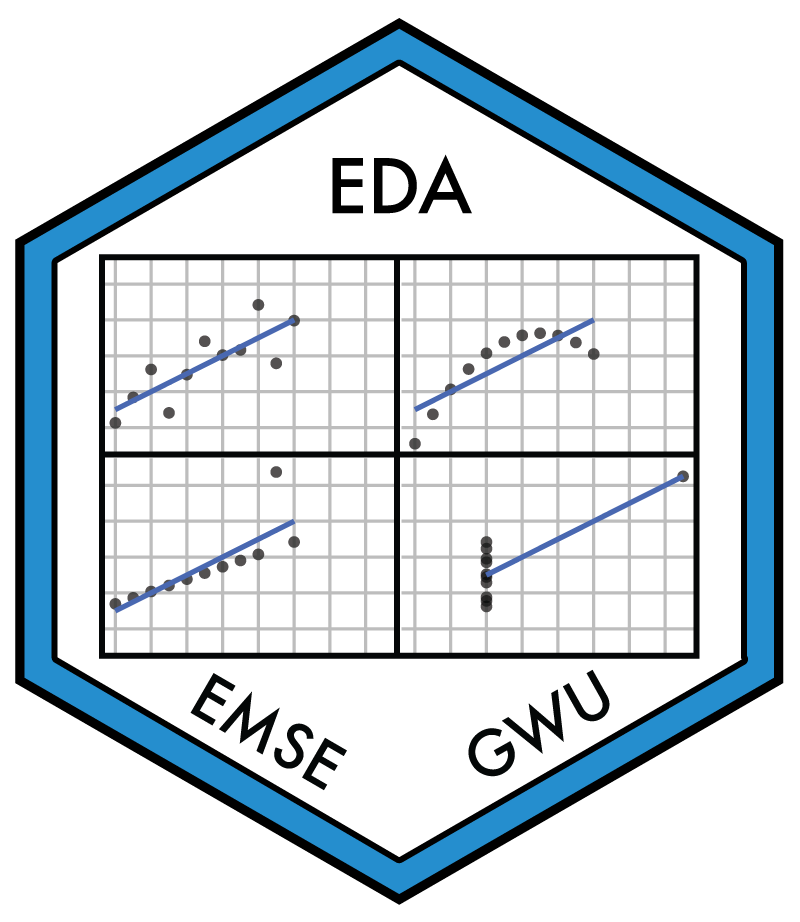

---
output:
  github_document:
    html_preview: false
---

<!-- README.md is generated from README.Rmd. Please edit that file -->

```{r child = "knitr_setup.Rmd"}
```

## EMSE 4575: Exploratory Data Analysis - Spring 2021 <a href='https://github.com/emse-eda-gwu/2021-Spring'></a>

<!-- badges: start -->

[![CC BY-NC-SA 4.0][cc-by-nc-sa-shield]][cc-by-nc-sa]
<!-- badges: end -->

### Description

```{r child = '_description.Rmd'}
```

For more details, please see the [course website](http://eda.seas.gwu.edu/2021-Spring/).

### Acknowledgments

This course was inspired by many other courses / resources that cover similar material - see the course [about page](http://eda.seas.gwu.edu/2021-Spring/about.html) for more details.
