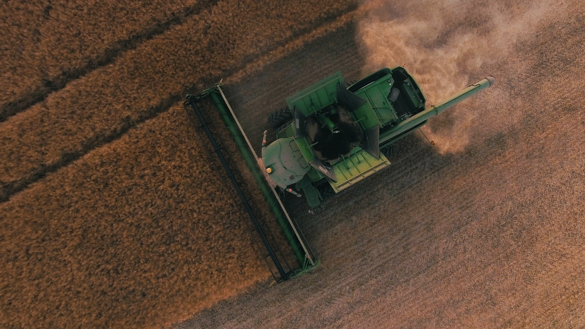

```{r child = "knitr_setup.Rmd"}
```

> **Due**: 06 April, 11:59 pm
>
> **Weight**: This assignment is worth 9% of your final grade.
>
> **Purpose**: We have spent a lot of time exploring data, but most of the time that has only involved a single data frame. This project will give you a chance to practice exploring and joining together multiple data files.
>
> **Assessment**: I will use [this rubric](projects/mini-project-3/rubric.html){target="_blank"} to grade your submissions.

# Background

<center>

</center>

For this assignment, you'll be exploring data on global crop yields from [Our World in Data](https://ourworldindata.org/crop-yields). The data have already been pre-processed and are available on [this](https://github.com/rfordatascience/tidytuesday/tree/master/data/2020/2020-09-01) GitHub repository - take a look at the data dictionaries on that page to get familiar with the five data sets we'll be working with and their variables.

# Tasks

## 1. Get organized

Download and unzip [this template](templates/project_template_mp3.zip) for your project, then open the `project.Rproj` file. Run the setup chunk in your `report.Rmd` file to load all of the five data frames:

- `key_crop_yields`
- `fertilizer`
- `tractors`
- `land_use`
- `arable_land`

**Note**: The template folders are just there as suggested names in case you want to use them.

## 2. Document the source

In your report, note that the original data came from the [Our World in Data page](https://ourworldindata.org/crop-yields) on crop yields and also that the formatted data you used came from the Tidy Tuesday [GitHub page](https://github.com/rfordatascience/tidytuesday/tree/master/data/2020/2020-09-01). You don't need to include the detailed data dictionaries.

## 3. Explore the source and preview the data

Go to the [Our World in Data page](https://ourworldindata.org/crop-yields) and view some of the charts. At the very top of the page you can click through all of the charts, or you can also scroll down and view charts that are related to key research questions on the page. Seeing the different questions and charts will help you get a sense for key trends and research questions related to the data.

Then in RStudio preview the data sets (e.g. using `head()`, `glimpse()`, `View()`, and / or make some quick plots). Take note of what variables are available, their types, their units, and what they measure. Hint: Read the data dictionaries on the GitHub page!

## 4. Clean the data

Most of the data frames are relatively "clean", but you may need to do some light cleaning before you dig into your analysis. Be careful to check the following:

- Are the column names easy to use?
- Are the units for common variables consistent across data frames?
- Are the data types correct?
- Do you need to reshape any of the data frames (i.e. using `gather()` or `spread()`)?

## 5. Identify research questions

Once you have a sense for what is captured in the data, list **at least three** questions you think you may be able to answer with these data (you can list more if you want). You can use some of the research questions on the [Our World in Data page](https://ourworldindata.org/crop-yields) page directly or for inspiration (for example, you could modify the question, "How have crop yields changed since 1960?" to be more specific about a single crop or a single region / country).

Your three research questions must meet these criteria:

- Only one can be a "ranking" question (e.g. which country / crop was the highest / lowest, etc.).
- At least one must be about a change over time.
- At least one must involve variables that exist in different data frames. For example, the `tractors` and `fertilizer` data frames could be joined to compare how fertilizer use (from the `fertilizer` data frame) and total population (from the `tractors` data frame) changed over time.

## 6. Search for answers

For **each** of your questions:

1. If necessary, modify and / or join together the data frames to address your question.
2. Compute summary measures (e.g. counts, centrality, variability, correlation) and create some simple summary charts (e.g. histogram, boxplot, scatterplot, etc.) using the variables relevant to your question. These are not "polished" charts but rather charts to help you see and understand key trends or relationships related to your research question. Note any key findings.

## 7. Create polished charts

For **each** of your questions:

1. Create a "polished" chart that highlights a key point related to your research question. It can be any chart type you wish, but it should be carefully chosen to convey a clear message.
2. Write a paragraph describing what you found. Describe the key message you intended to convey with your chart and note some of the design choices you made to emphasize that point.

Important points to consider in your charts:

- Did you modify the theme to avoid distracting elements?
- Have you annotated your chart effectively? (title, subtitle, axis labels, chart annotations, etc.)
- Have you chosen colors carefully?
- Do the chart dimensions need to be adjusted?
- Is the font family and size clear and easy to read?

## 8. Knit and submit

Click the "knit" button to compile your `.Rmd` file into a html web page, then create a zip file of everything in your R Project folder. Go to the "Assignment Submission" page on Blackboard and submit your zip file under "Mini Project 3."

