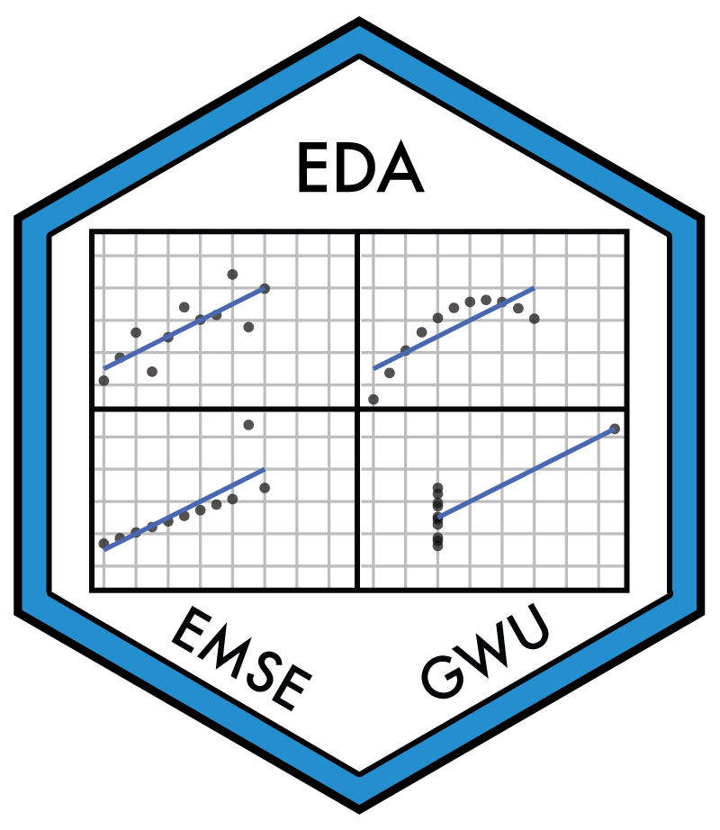

```{r child = "knitr_setup.Rmd"}
```

```{r setup, message=FALSE, warning=FALSE, include=FALSE}
library(metathis)

meta() %>%
  meta_description(
    'Course website for Spring 2021 semester of the EMSE course "Exploratory Data Analsis" at GWU'
  ) %>%
  meta_name("github-repo" = "emse-eda-gwu/2021-Spring") %>%
  meta_viewport() %>%
  meta_social(
    title = "EMSE 4575: Spring 2021",
    url = "https://eda.seas.gwu.edu/2021-Spring/",
    image = "https://eda.seas.gwu.edu/images/eda_hex_sticker.png",
    image_alt = "Hex sticker for class logo showing Anscombe's quartet",
    og_type = "website",
    og_author = c("John Paul Helveston"),
    twitter_card_type = "summary",
    twitter_creator = "@JohnHelveston"
  )
```

<div class = "row">

<div class = "col-md-3">

</div>

<div class = "col-md-9">

**Department**: [Engineering Management and Systems Engineering](https://www.emse.seas.gwu.edu/) @ [GWU](https://www.gwu.edu/)

**Credits**: 3

**Description**:

```{r child = '_description.Rmd'}
```

**Learning Objectives**:

```{r child = '_learning-objectives.Rmd'}
```

**Prerequisites**:

```{r child = '_prerequisites.Rmd'}
```

</div>
</div>
